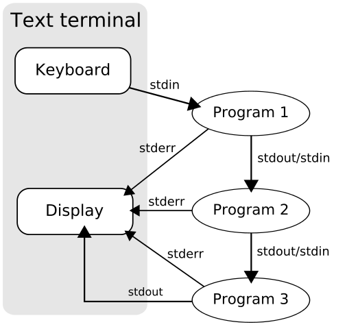

% Komentorivi ja tekstinlouhinta
% Antti Härkönen
% 2021-10-14

# Tekstinlouhinta

# Korpus

- kokoelma tekstejä
- suurehko aineisto

# Big data

- liian suuri aineisto perinteisille analyysimenetelmille

# Siisti data

# Powershell

# UNIX-filosofia

- yksi ohjelma tekee yhden asian hyvin

#

# Komentoriviputki
