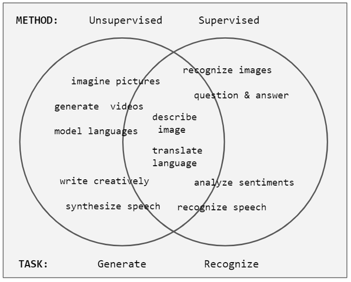

% Komentorivi ja tekstinlouhinta
% Antti Härkönen
% 2021-11-09

# Tutkimusdatan organisointi

## Datan muoto

- data tiedostossa: onko koneen luettavissa -> silloin yleensä myös saavutettava 
ja helpommin muunnettavissa formaatista toiseen
- avoimet ja ”agnostiset” (platform agnostic) formaatit suositeltavia
- esimerkki: [utf-8](https://www.youtube.com/watch?v=MijmeoH9LT4) ja mojibake (korjattavissa pythonilla: ftfy)

## Tekstidata

- jos data on pelkkää tekstiä ja numeroita, kannattaa käyttää tekstipohjaisia formaatteja (md, txt, csv)
- binäärimuotoinen tekstidata (docx) on vaikeampaa käyttää

## Datan tallennus

- merkityksellinen ja looginen kansiorakenne
- kansiorakenne voi sisältää informaatiota datan keskinäisistä suhteista

## Tiedostojen nimeäminen

- erottava tieto nimen loppuun
- välilyönnit ovat esim. komentorivillä merkitseviä erottajia, siksi niitä kannattaa välttää

##

| nimikonventio | esimerkki |
|---|---|
| camel case | suurtenMuinaistenAika |
| snake case | suurten_muinaisten_aika |
| kebab case | suurten-muinaisten-aika |

## Päivämäärät

- [ISO-standardin 8601](https://fi.wikipedia.org/wiki/ISO_8601) mukainen päivämäärä: vvvv-kk-pp
- pvm alussa, vvvv-kk-pp -> tietokone laittaa tiedostot automaattisesti kronologiseen järjestykseen

##

- `/artikkelit/2021/Tohmajarven_historiaa/data/raaka/1991-06-02_Punkalaidun.csv`
- `/artikkelit/2021/Tohmajarven_historiaa/data/raaka/1991-06-02_Punkalaidun_raty.csv`

# Tekstinlouhinta

## Kaukoluenta

- makroskooppinen katsaus tekstiin
- Suomessa käyttänyt mm. Risto Turunen ([väitöskirja](https://trepo.tuni.fi/handle/10024/130891))

## Tekstinlouhinta

- tekstimassojen automaattista lukemista (esim. hakuja)
- [Voyant](https://voyant-tools.org/): OS-työkalu, yleisesti käytetty digitaalisen humanismin projekteissa
- [von der Leyenin puhe](https://agricolaverkko.fi/tietosanomat/milta-ursula-von-der-leyenin-puhe-nayttaa-etaalta-luettuna)

## Korpus

- kokoelma tekstejä
- suurehko aineisto
- [Johdatus korpuslingvistiikkaan](https://hfroehli.ch/2014/05/11/intro-bibliography-corpus-linguistics/)

## Regex-haut

- säännölliset lausekkeet (regex) mahdollistavat sumeat haut
- esimerkiksi `1991*` löytää kaikki sanat, joissa 4 ensimmäistä merkkiä ovat 1991
- [Understanding Regular Expressions](https://programminghistorian.org/en/lessons/understanding-regular-expressions)

## Big data

- liian suuri aineisto perinteisille analyysimenetelmille

## Siisti data

- sarake on muuttuja
- rivi on havainto
- solussa vain yksi arvo
- ei poikkeuksia!
- [tidy data](https://cran.r-project.org/web/packages/tidyr/vignettes/tidy-data.html)

# Terminaali

##

 Wikimedia Commons 

## UNIX-filosofia

- yksi ohjelma tekee yhden asian hyvin
- GNU/Linux noudattaa tätä periaatetta
- Windowsin ohjelmistot ovat sen sijaan monoliittisia

##

 TuukkaH, XcepticZP, jaettu Wikimedia Commonsissa 

## Powershell

- Microsoftin monelle alustalle tarkoitettu komentokehote
- omat komennot, ymmärtää myös monet bash-komennot
- Programming historian -sivustolla [artikkeli](https://programminghistorian.org/en/lessons/intro-to-powershell)

## Navigointi

| navigointikomennot | merkki |
|-----|----|
| koti | `~` |
| nykyinen kansio | `.` |
| ylempi kansio | `..` |

## Tärkeitä työkaluja

- putkioperaattori `|`
- uudelleenohjausoperaattori, `>` ja `>>`
- ohjelman keskeytys **CTRL-C**

## Kopioiminen

`cp ./tiedosto/polku/teksti1.txt ./toinen/tiedosto/polku/teksti2.txt`

## Toisto

- silmukka: `for`
- rekursio: hyödyllistä mutta vaarallista
- Monte Carlo -simulaatio (iteroidaan kunnes malli näyttää tarpeeksi hyvältä)

##

| PS-komento | Lyhenne | UNIX-vastine |
|-----|------|-----|
| Get-Help   | help | man |
| Set-Location | sl | cd / chdir (kansio) |
| Get-Location | gl | pwd |
| Get-Content | gc | cat |
| Get-ChildItem | gci | dir/ls |
| Rename-Item | rni | mv |
| Copy-Item | copy, cpi | cp |
| New-Item | ni | touch / mkdir (kansio) |
| Write-Output | write | echo |
| Select-String | sls | grep |

## Select-String

- `Select-String` mahdollistaa säännöllisten hakulausekkeiden käytön
- `sls tiedosto.txt -Pattern '\d{4}'` löytää kaikki neljän numeron ryhmät
- myös tiedostojen nimissä voi käyttää vastaavia temppuja: `sls kansio\*.txt -Pattern '\d{4}'`
- operaattorin `>` avulla hakutulokset voi kirjoittaa tiedostoon

# Tekoäly

## Koneoppiminen

- "tekoäly" koostuu yleensä melko yksinkertaisista algoritmeista, mutta vaatii paljon laskutehoa
- koneoppiminen vaatii suuria aineistoja
- esim. Transcribuksessa käytetyt HTR-mallit vaativat 500 sivua ihmisen tunnistamaa tekstiä opetusdataksi

## 

 Numiri, jaettu Wikimedia Commonsissa 

## Aihemallinnus

- samanlaisissa yhteyksissä esiintyvät sanat ovat todennäköisimmin osa samaa diskurssia
- ohjaamatonta oppimista

## Latentti Dirichlet-allokaatio (LDA)

- yleisin aihemalli
- optimaalinen malli lasketaan Monte Carlo -menetelmällä
- tulokset voivat siis vaihdella!

##

 Slxu.public, jaettu Wikimedia Commonsissa 

## MALLET

- komentorivipohjainen työkalu
- Programming historian -sivustolla on aiheesta 
[artikkeli](https://programminghistorian.org/en/lessons/topic-modeling-and-mallet)
- korpus on ensin muutettava Malletin ymmärtämään muotoon
- tämän jälkeen aineiston avulla voi kouluttaa LDA-mallin

# Lopuksi

- Tietokone on työkalu. Se ei tunne totuutta sen enempää kuin ruohonleikkuri.
