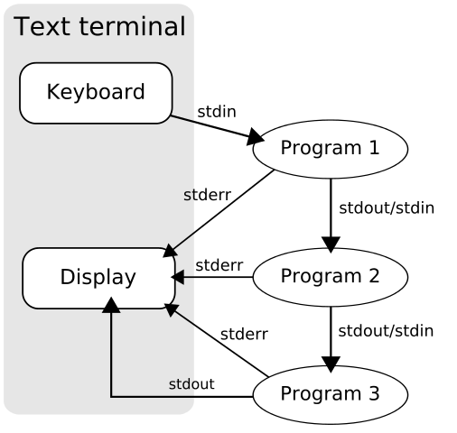
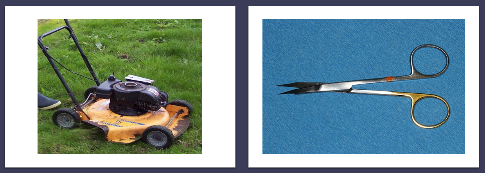

% Komentorivi ja tekstinlouhinta
% Antti Härkönen
% 2021-10-14

# Tutkimusdatan organisointi

# Datan muoto

- data tiedostossa: onko koneen luettavissa -> silloin yleensä myös saavutettava 
ja helpommin muunnettavissa formaatista toiseen
- avoimet ja ”agnostiset” (platform agnostic) formaatit suositeltavia
- esimerkki: [utf-8](https://www.youtube.com/watch?v=MijmeoH9LT4) ja mojibake (korjattavissa pythonilla: ftfy)

# Tekstidata

- jos data on pelkkää tekstiä ja numeroita, kannattaa käyttää tekstipohjaisia formaatteja (md, txt, csv)
- binäärimuotoinen tekstidata (docx) on vaikeampaa käyttää

# Datan tallennus

- merkityksellinen ja looginen kansiorakenne
- kansiorakenne voi sisältää informaatiota datan keskinäisistä suhteista

# Tiedostojen nimeäminen

- erottava tieto nimen loppuun
- välilyönnit ovat esim. komentorivillä merkitseviä erottajia, siksi niitä kannattaa välttää

#

| nimikonventio | esimerkki |
|---|---|
| camel case | suurtenMuinaistenAika |
| snake case | suurten_muinaisten_aika |
| kebab case | suurten-muinaisten-aika |

# Päivämäärät

- [ISO-standardin 8601](https://fi.wikipedia.org/wiki/ISO_8601) mukainen pvm: vvvv-kk-pp
- pvm alussa, vuosi-kk-pp -> tietokone laittaa tiedostot automaattisesti kronologiseen järjestykseen

#

- `/artikkelit/2021/Tohmajarven_historiaa/data/raaka/1991-06-02_Punkalaidun.csv`
- `/artikkelit/2021/Tohmajarven_historiaa/data/raaka/1991-06-02_Punkalaidun_raty.csv`

# Tekstinlouhinta

- [Voyant](https://voyant-tools.org/): OS-työkalu, yleisesti käytetty digitaalisen humanismin projekteissa
- [von der Leyenin puhe](https://agricolaverkko.fi/tietosanomat/milta-ursula-von-der-leyenin-puhe-nayttaa-etaalta-luettuna)

# Korpus

- kokoelma tekstejä
- suurehko aineisto
- [Johdatus korpuslingvistiikkaan](https://hfroehli.ch/2014/05/11/intro-bibliography-corpus-linguistics/)

# Big data

- liian suuri aineisto perinteisille analyysimenetelmille

# Siisti data

- [tidy data](https://cran.r-project.org/web/packages/tidyr/vignettes/tidy-data.html)
- sarake on muuttuja
- rivi on havainto
- solussa vain yksi arvo
- ei poikkeuksia!

# UNIX-filosofia

- yksi ohjelma tekee yhden asian hyvin
- GNU/Linux noudattaa tätä periaatetta
- Windowsin ohjelmistot ovat sen sijaan monoliittisia

#

# Komentoriviputki

# Vertauskuva

Kuvat: Wikimedia Commons

# Navigointi

| navigointikomennot | merkki |
|-----|----|
| koti | `~` |
| nykyinen kansio | `.` |
| ylempi kansio | `..` |

# Tärkeitä työkaluja

- putkioperaattori `|`
- uudelleenohjausoperaattori, `>` ja `>>`
- ohjelman keskeytys **CTRL-C**

# Kopioiminen

`cp ./tiedosto/polku/teksti1.txt ./toinen/tiedosto/polku/teksti2.txt`

# Toisto

- iterointi: `for`
- rekursio: hyödyllistä mutta vaarallista

#

| PS-komento | Lyhenne | UNIX-vastine |
|-----|------|-----|
| Get-Help   | help | man |
| Set-Location | sl | ch / chdir (kansio) |
| Get-Location | gl | pwd |
| Get-Content | gc | cat |
| Get-ChildItem | gci | dir/ls |
| Rename-Item | rni | mv |
| Copy-Item | copy, cpi | cp |

#

| PS-komento | Lyhenne | UNIX-vastine |
|-----|------|-----|
| New-Item | ni | touch / mkdir (kansio) |
| Write-Output | write | echo |
| Select-String | sls | grep |
| For-Each | foreach | for ... in |
| Measure-Object | measure | wc / lc |
| Select-Object | select |  |