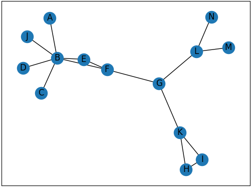

% Verkostoanalyysi
% Antti Härkönen
% 2021-11-16

# Sosiologista taustaa

## Sosiaalinen verkostoanalyysi

- joukko lähestymistapoja ihmisten välisten suhteiden tutkimiseen
- perustuu graafiteoriaan, joka on matematiikan osa-alue
- verkosto on graafi, toisin kuin toimijaverkkoteoriassa (ANT)

#

# Graafiteoria

## Graafi

- solmu
- yhteys

## Solmut

- eivät ole aina ihmisiä
- solmu, piste, aktori

## Yhteydet

- kaari, linkki, side, yhteys
- suunnattu tai suuntaamaton yhteys
- yhteyksillä voi olla eri painoarvoja
- yhteydet voivat olla laadullisesti erilaisia

## Visualisointi

- graafi piirretään yleensä palloina ja viivoina
- yhden verkoston voi visualisoida lukemattomilla eri tavoilla

## Keskeisyys

- keskeisyys
- keskeisyyden ominaisvektori (Eigenvector centrality)
- välillisyyskeskeisyys
- läheisyyskeskeisyys
- tiheys

# Verkostoanalyysi ihmisillä

## Sosiaaliset verkostot

- välillisyyden avulla voi löytyä yllättäviä vallankäyttäjiä verkostojen sisällä
- keskeisyyksien avulla voi löytää verkoston rakenteesta piirteitä, jotka eivät ole ilmiselviä

## Historiassa

- poliittiset verkostot
- [Journal of Historical Network Research](https://jhnr.uni.lu/index.php/jhnr/index) 
- esim. Itä-Saksan opposition verkostot (Kimmo Elo)

## Esimerkkejä

- sukupuut
- solmut voivat olla ihmisiä, kaupunkeja tai muita organisaatioita
- yhteydet voivat olla muuttoliikettä, kirjeenvaihtoa, luotonantoa, kummisuhteita

# Palladio

## Taustaa

- selainpohjainen [sovellus](https://hdlab.stanford.edu/palladio-app)
- Stanfordin yliopiston _Humanities + Design_ -keskuksen työkalu
- tarkoitettu avaamaan verkostot, kartat ja aikajanat humanisteille

## Data

- näissä harjoituksissa käytetään vain csv-muotoisia aineistoja verkostojen kuvaamiseen
- geojson-formaatissa oleva vektoridata
- saman datan voi esittää graafina, karttana, aikajanana tai näiden yhdistelmänä

# Lopuksi

- verkostoja löytyy kaikkialta