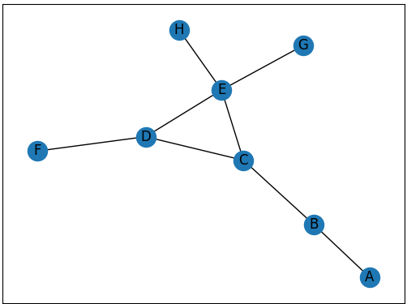

# Harjoitus 1

Piirrä kuvan verkosto Palladion avulla.

# Harjoitus 2

Valitse haluamasi kunta ja vuosi Tilastokeskuksen tilastosta 11a1. 
Tee datan perusteella kartat miesten ja naisten muutosta. 
Käytä erivärisiä ympyröitä määrien visualisointiin.