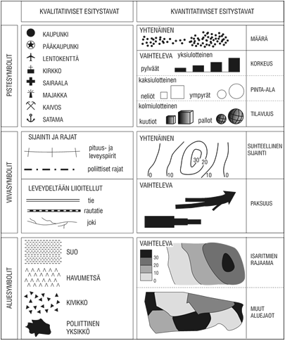

% Teemakartat
% Antti Härkönen
% 2021-11-23

# Geoinformatiikka

## GIS

- Geographic Information Systems
- yleensä myös kuvaa nykyistä spatiaalista tiedettä laajemmin

## Paikkatieto

- sijaintitieto
- ominaisuustieto
- data yleensä SQL-tietokannoissa
- paikkatietokanta on spatiaalisen tieteen ydin
- perinteinen kartta on vain yksi tapa visualisoida paikkatietoa

## Vektori- ja rasteridata

- kaksi paikkatiedon päätyyppiä
- rasteridata vie paljon enemmän muistia
- vektoridataa on helpompi käyttää
- vektoridata on helppo muuttaa rasteriksi, mutta rasterin muuttaminen vektoriksi vaatii joko käsityötä tai tekoälyä

## Rasteri

- pikseleistä koostuva kuvatiedosto
- skannattu kartta, satelliittikuva, ilmakuva

## Vektori

- yksinkertainen formaatti
- piste, viiva, monikulmio, tai näiden yhdistelmä
- vektoreiden välisten spatiaalisten suhteiden määrittäminen on helppoa

# Kartografia

## Historiaa

- karttojen piirtäminen on vanhin tapa esittää paikkatietoa
- perinteisiä ongelmia: kuinka esittää maapallo kaksiulotteisella paperilla, mitä informaatiota sisällyttää
- geoidit, projektiot ja koordinaattijärjestelmät

## Moderni kartografia

- geoinformatiikan ansiosta kartat voidaan vapauttaa paperin staattisuudesta
- interaktiiviset ja päivittyvät kartat, myös kartta-animaatiot
- kaukokartoitus mahdollistaa nopeat pikakartoitukset

## Datavisualisointi

- kattokäsite, johon myös kartografia kuuluu
- tilastolliset kaaviot ja muut esitykset
- esteettinen näkökulma

## Funktio

- mitä varten visualisointi tehdään?
- turha informaatio pois

## Abstraktiotaso

- äärimmäisen tärkeä asia visualisoinnissa, etenkin kartoissa
- turha informaatio pois

# QGIS

## Taustaa

- vapaa ja avoin työpöytäsovellus
- käytössä tutkimuksessa, yrityksissä, kansalaisjärjestöissä, julkishallinnossa ympäri maailmaa
- avoin lähdekoodi on tärkeää tieteen ja päätöksenteon läpinäkyvyyden kannalta!
- QField mobiililaitteisiin

## Työkalut

- työkaluja on niin paljon, ettei kaikkia voi esittää samaan aikaan käyttöliittymässä
- paljon työkaluja saatavilla lisäosina

## Georeferointi

- paikkatiedon yhdistäminen oikeaan sijaintitietoon
- vanhojen karttojen ja asemakaavojen georeferointi vaatii oikaisupisteita (_Ground Control Point, gcp_)
- vaatii pisteitä, jotka sijainti tiedetään muun paikkatiedon, kuten vertailukartan, avulla

## Vektorointi

- rasterimuotoisen datan (vanha kartta tai ilmakuva) muuttaminen vektorimuotoon
- tapahtuu käytännössä luomalla joukko uusia vektoritasoja, ja piirtämällä ne kartan päälle

# Teemakartat

#

Helsingin yliopisto. Kvalitatiiviset ja kvantitatiiviset esitystavat

## Koropleettikartat