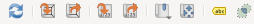
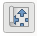
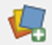

# Demo 1

Tämän harjoituksen tarkoituksena on tehdä yksinkertainen havainnollistava kartta QGIS-ohjelmistolla. 
Kuvitellaan, että teet opinnäytetyötä legendaarisesta keihäänheittäjästä Seppo Rädystä ja haluat esittää hänen
kotikuntansa Suomen kartalla.

1. Tarkista, että koneelle on asennettu QGIS 3.x
2. Tee itsellesi karttaa varten projektikansio sopivaan paikkaan.
3. Avaa QGIS ja luo uusi projekti (**Projekti > Uusi**). Tallenna projekti nimellä Harjoitus 1. 
4. Mene Paituli-paikkatietopalveluun ja lataa Tilastokeskuksen _Kuntien avainluvut vuodelta 2017_. Pura zip-tiedosto projektikansioon. **HUOM! shp-tiedosto koostuu useasta saman nimisestä tiedostosta!**
5. Lisää _kuntienAvainluvut_2017.shp_ tasoksi karttaan (**Selain > oikea klikkaus > Add selected layer to canvas**). Ruudulla pitäisi nyt näkyä Suomen kartta kuntarajoineen. 
6. Voit liikutella karttaa **raahaus**- ja **zoomaus**-työkaluilla. Jos kartta häviää näkyvistä, saat sen takaisin komennolla **hiiren oikea päällä > Zoomaa tasoon**. 
7. Kokeile vaihtaa kartan projektiota (**Projekti > Ominaisuudet > Koordinaattijärjestelmä** > ). Mitkä projektiot sopivat mihinkin parhaiten?
8. Vaihda karttatason väriä: **Oikea klikkaus tasosta > Ominaisuudet > Kuvaustekniikka > Yksinkertainen täyttö > Täyttöväri**. 
9. Luodaan tulostuskelpoinen karttaesitys QGISin taittotyökalulla. Luo uusi taitto (**Projekti > Uusi taitto**). 
Anna taitolle nimi Tohmajärvi. 
10. Tee kartasta pystyssä oleva A4. Klikkaa taiton keskeltä hiiren oikealla näppäimellä, ja valitse Sivun ominaisuudet. Valitse kooksi A4 ja suunnaksi pysty. 
11. Klikkaa  ja piirrä hiirellä koko arkin kokoinen karttaelementti. 
Suomen kartan pitäisi ilmestyä keskelle. 
12. Kavenna karttaelementtiä 40 mm oikealta, jotta pienemmälle kartalle jäisi enemmän tilaa. 
13. Valitse kartta, mene **Elementin ominaisuudet** –kohtaan ja aseta mittakaavaksi _1:4 000 000_. 
Paina sen jälkeen **Update Preview**. 
14. Elementin ominaisuuksissa on  työkalupalkki, jonka avulla kartan mittakaavaa ja sijaintia voi säätää taitossa.  
Napista  voi siirtää elementin sisältöä raahaamalla ja zoomaamalla.
15. Lukitse taso: **Elementit > Rasti ruutuun lukon kuvan alapuolla**
16. Klikkaa  ja piirrä hiirellä uusi karttaelementti Suomen kartan viereen. 
17. Mene takaisin karttaikkunaan, ja laita nimiöt päälle. Käytä nimiöiden perustana NIMI-saraketta
(**hiiren oikea näppäin > Ominaisuudet > Nimiöt**; Eri kuin KUNTA!) Aseta **Teksti**-kohdasta nimiöiden kooksi 12.
18. Jotta kuntien nimet eivät näkyisi muualla kuin pienessä kartassa, asetetaan nimiöille rajoitettu mittakaava. 
**Ominaisuudet > Nimiöt > Karttanäyttö > Nimiön valinnat > Mittakaavaperustainen näkyvyys**. Aseta pienimmäksi näkyväksi mittakaavaksi _1:1 250 000_. 
19. Zoomaa karttaikkunassa Tohmajärven kunnan kohdalle. 
20. Mene takaisin taittoon, aseta mittakaavaksi _1:1 000 000_ ja klikkaa uudestaan **Update preview**. 
21. Valitse isompi kartta ja mene **Elementin ominaisuudet > Yleiskatsaukset**. Paina merkkiä , jolloin alla olevaan laatikkoon ilmestyy Yleisnäkymä 1. 
Aseta Kartan kehys –kohtaan pienempi kartta. 
22. Kun olet tyytyväinen karttaikkunoihin, lukitse molemmat. 
23. Lisää mittakaavajana karttaan . 
Käytä mittakaavan perusteena isompaa karttaa, ja säädä janan kokoa säätämällä kohtaa **kiinteä leveys**. Kun olet tyytyväinen, lukitse mittakaavataso. 
24. Lisää pohjoisnuoli  –painikkeesta. Piirrä nuolen alue ja valitse sopiva nuoli. 
25. Tallenna kartta kuvaksi kohdasta **Taitto > Vie kuvaksi**. Valmiin kartan pitäisi näyttää suunnilleen tältä:

# Demo 2

Tässä harjoituksessa opetellaan käyttämään WFS- ja WMS-rajapintoja sekä tekemään vektoritiedostoista valintoja eri menetelmillä.

1. Avaa uusi projekti QGISillä. 
2. Etsi ja kopioi netistä Paikkatietopalvelu Paitulin WMS-rajapinnan URL-osoite. 
3. Paina QGISin painiketta  ja valitse **WMS/WMTS**. Luo uusi tietolähde, anna sille nimeksi Paituli, ja URLiksi etsimäsi rajapinnan osoite. 
4. Lisää Tilastokeskuksen WFS-palvelu ([http://geo.stat.fi/geoserver/tilastointialueet/wfs](http://geo.stat.fi/geoserver/tilastointialueet/wfs)) nimellä Tilastointialueet. 
Tämä toimii samalla tavalla kuin edellinen kohta, paitsi että valikosta valitaan **WFS**.
5. Lisää samalla tavalla Tilastokeskuksen WFS-palvelu ([http://geo.stat.fi/geoserver/vaestoalue/wfs](http://geo.stat.fi/geoserver/vaestoalue/wfs)) nimellä Väestöalueet. Tarkista, että tämäkin on WFS-yhteys.
6. Lisää _Väestö 2017 vuoden 2018 kuntajaolla ja maakuntajaolla_ –tasot karttaan. 
7. Siirrä kuntataso päällimmäiseksi ja muuta ontoksi (**Ominaisuudet > Kuvaustekniikka > Täyttö > Yksinkertainen täyttö > Symbolitason tyyppi > Ääriviivat**). Valitse viiva ja aseta sen leveydeksi 0.2 mm. 
8. Valitse Pohjois-Karjalan maakunta maakuntatasosta. Avaa **Valitse kohteita kentän arvon perusteella**  ja pane nimikenttään Pohjois-Karjala. 
9. Tallenna valittu Pohjois-Karjala projektikansioosi (navigoi oikeaan kansioon **selaa**-kohdassa) GeoPackage-tiedostona (**hiiren oikea näppäin > Vie > Tallenna VALITUT kohteet nimellä**).
10. Valitse Pohjois-Karjalan kunnat käyttämällä luomaasi GeoPackage-tiedostoa. Avaa **Valitse sijainnin perusteella** ja valitse ainoastaan _sisältyvät_ kohteet. 
11. Aktivoi kuntataso Tasot-valikosta ja klikkaa ∑-symbolia. 
12. Valitse _vaesto_-sarake valikosta. Klikkaa **Käytetään vain valittuja kohteita**. 
13. Kopio tilastoyhteenveto, ja tallenna se vapaavalintaisella taulukkolaskentaohjelmistolla. 
14. Toista vaiheet 8–13, tällä kertaa Pirkanmaan maakunnalla. Lisää Pirkanmaan tilastoyhteenveto Pohjois-Karjalan rinnalle ja tallenna taulukko. 
15. Tallenna Pohjois-Karjalan kunnat omaksi GeoPackage-tiedostokseen. 
16. Tee Pohjois-Karjalan kartta edellisen demon ohjeiden mukaan.

# Demo 3

Tässä harjoituksessa opetellaan luomaan omaa vektorimuotoista dataa vanhoista kartoista tai ilmakuvista.

1. Mene Astian sivulle, tee haku sanoilla joensuu kartat ja avaa [Joensuun kaupungin asemakaava. 
(Joensuu Ieb* 3/- -)](https://astia.narc.fi/uusiastia/).
2. Lataa asemakaava projektikansioon.
3. Mikäli georeferointi-työkalu ei ole näkyvissä (**Tasot > Georeferointi** tai, versiosta riippuen, **Rasteri > Georeferoija**), se on aktivoitava Lisäosat-valikosta
**Lisäosat > Hallitse ja asenna lisäosia** ruksaamalla listalta **Georeferoija**-lisäosa.
4. Georeferointia varten tarvitaan oikaisupisteitä. Helpointa tämä on toisen kartan avulla. Etsi jostain lähteestä valmis paikkatietoaineisto georeferointia varten. Vertailuaineiston on oltava niin tarkka, että siitä erottaa rakennusten sijainnin.
5. Avaa **Tasot > Georeferointi** ja lisää napista  Joensuun kaava georeferoitavaksi. Aseta koordinaattijärjestelmäksi _EPSG:3067_. 
6. Lisää oikaisupiste käyttämällä nappia . Klikkaa ensin georeferoitavasta kartasta, sen jälkeen ota koordinaatit **Karttaikkunasta**-kohdasta ja klikkaamalla vertailukarttaa.
Pisteitä voi poistaa napista  ja siirtää napista . 
7. Kun olet lisännyt 5-10 hyvää pistettä, voit tallentaa pisteet napista .
8. Ennen oikaisua tarkista **Muunnoksen asetuksista**  että **Muunnoksen tyyppi** on _Helmert_ ja että **Tulostiedosto** ja **Tulostiedoston koordinaattijärjestelmä** on määritelty.
9. Tee oikaisu painamalla . Lisää oikaistu kuva karttaan. 
10. Luo uusi GeoPackage-tiedosto nimeltä korttelit. Katso että sen tyyppi on _monikulmio_ (tai _polygoni_) ja lisää uudeksi attribuuttikentäksi _numero_ (**Uusi kenttä**). Aseta tallennuspaikaksi projektin kansio. 
11. Tee samanlainen taso nimellä tontit. 
12. Digitoi Pielisen itäpuolisen alueen korttelit ja tontit. Aloita valitsemalla taso ja painamalla 
. Painikkeesta  pääset piirtämään uusia monikulmioita. Hiiren vasemmalla painikkeella tehdään uusi kulma, ja piirtäminen lopetetaan hiiren oikealla painikkeella. 
Muista tallentaa tekemäsi muutokset välillä. 
13. Kun olet digitoinut joen itäpuolen, poista alkuperäinen kartta näkymästä, ja lisää karttaan Paitulin WMS:n kautta Maanmittauslaitoksen peruskartta vuodelta 2015. 
14. Muuta korttelit ja tontit läpinäkyviksi (**Ominaisuudet > Kuvaustekniikka > Peittävyys**) ja vertaa niitä peruskarttaan.
